# Procesverslag
Markdown is een simpele manier om HTML te schrijven.  
Markdown cheat cheet: [Hulp bij het schrijven van Markdown](https://github.com/adam-p/markdown-here/wiki/Markdown-Cheatsheet).

Nb. De standaardstructuur en de spartaanse opmaak van de README.md zijn helemaal prima. Het gaat om de inhoud van je procesverslag. Besteedt de tijd voor pracht en praal aan je website.

Nb. Door *open* toe te voegen aan een *details* element kun je deze standaard open zetten. Fijn om dat steeds voor de relevante stuk(ken) te doen.

## Jij

  
uitwerken voor kick-off werkgroep

  ### Auteur:
  Robin Elseman 😎

  #### Je startniveau:
  Rood

  #### Je focus:
  Responsive & surface plane
 

## Je website

  
uitwerken voor kick-off werkgroep

  ### Je opdracht:
  [Stussy's website link](https://eu.stussy.com/)

  #### Screenshot(s) van de eerste pagina (small screen): 
  Homepage 
  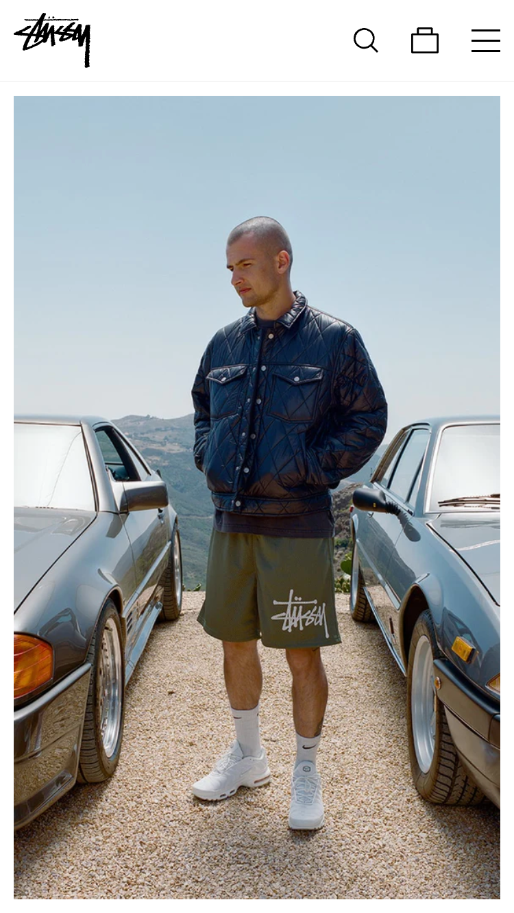

---

  #### Screenshot(s) van de tweede pagina (small screen):
  Productpagina 
  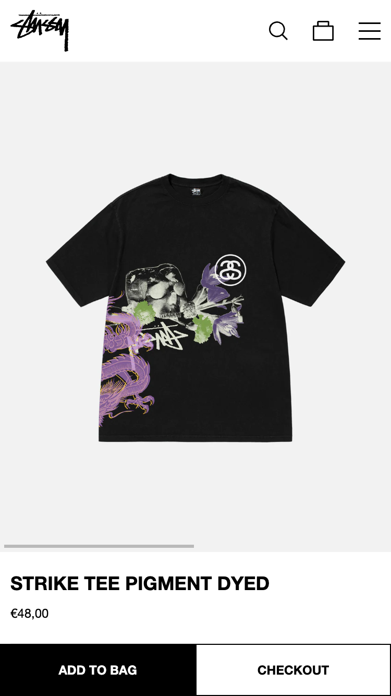

## Toegankelijkheidstest 1/2 (week 1)

  
uitwerken na test in 2e werkgroep

  ### Bevindingen
  Lijst met je bevindingen die in de test naar voren kwamen:
  <ul>
  <li>De headings hebben een logische volgorde. Dit is dus een positief iets om niet te veranderen in de nieuwe verbeterde versie van deze site.</li>
  <li>Accessibility wordt pas laat verteld, dit kan anders. Wat mij betreft is de site opzichzelf al accessible en hoeven er hier geen settings voor worden aangepast. Sowieso moet hier eerst aandacht aan worden gevestigd zodat de gebruiker hier gelijk gebruik van kan maken als dat nodig is.</li>
  <li>Links hebben een goede beschrijving over de bestemming. Dit is dus een positieve eigenschap van de website waar niet veel aan hoeft worden veranderd.</li>
  <li>Voor screenreaders is het onduidelijk dat er onder shop meerdere subcategoriëen zijn. Hetzeflde geldt voor customer service. Dit is voor mensen die deze optie gebruiken extreem onhandig. Hier moet een duidelijk onderscheid in komen.</li>
  <li>Focus punten op de site kan worden verbeterd. Als er door de website wordt genavigeerd is het vaak lastig tot niet duidelijk waar de focus ligt. Hier is dus ruimte voor verbetering.</li>
  <li>De website werkt op alle oriëntaties. Dit is ook een positieve eigenschap van een goede responsive website.</li>
  <li>Horizontale scrolls worden niet gebruikt. Dit wil ik graag zo houden, omdat dit vaak niet heel accessible is.</li>
  <li>Buttons kunnen misschien iets groter, voor mensen met motorische beperkingen. Dat is iets waar ik aandacht aan ga besteden op de nieuwe verbeterde website.</li>
  <li>Scroll ruimte is voldoende aanwezig.</li>
  <li>Alt teksten zijn niet voldoende. Hier zal ik dus ook veel meer aandacht aan geven. Voor mensen die afhankelijk zijn van deze altteksten is het zeer hinderlijk om dit niet goed te benutten.</li>
            
  </ul>
  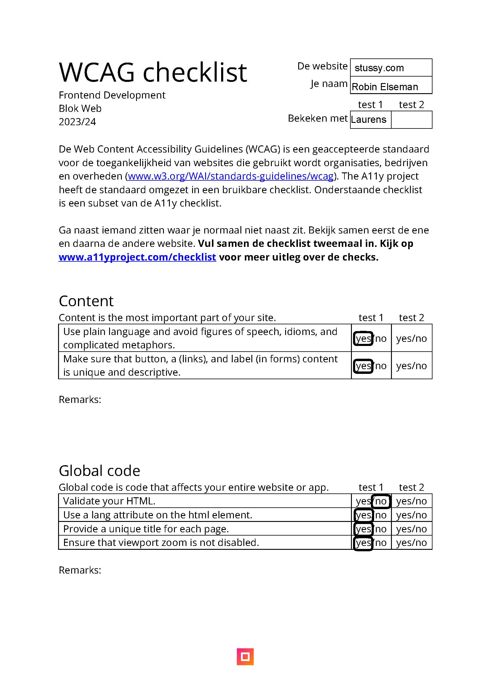
  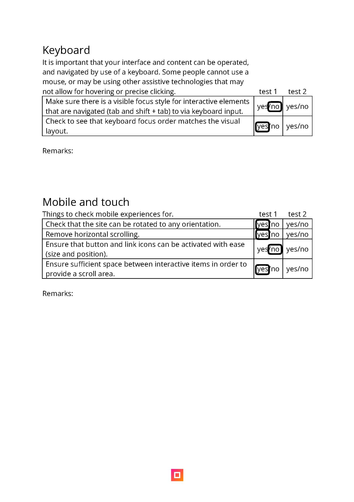
  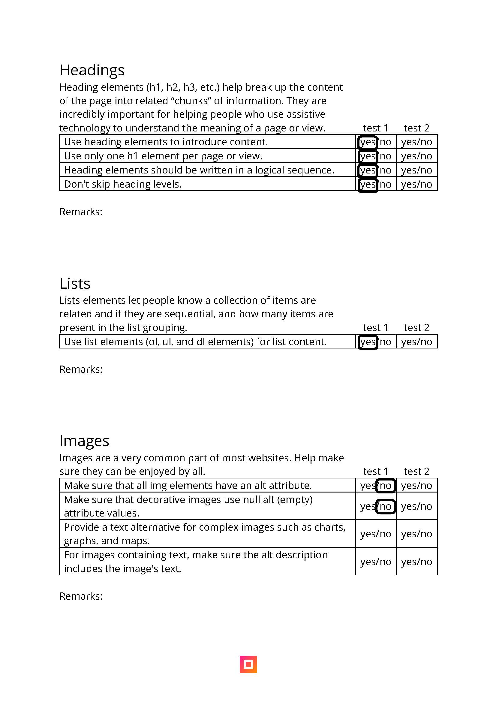
  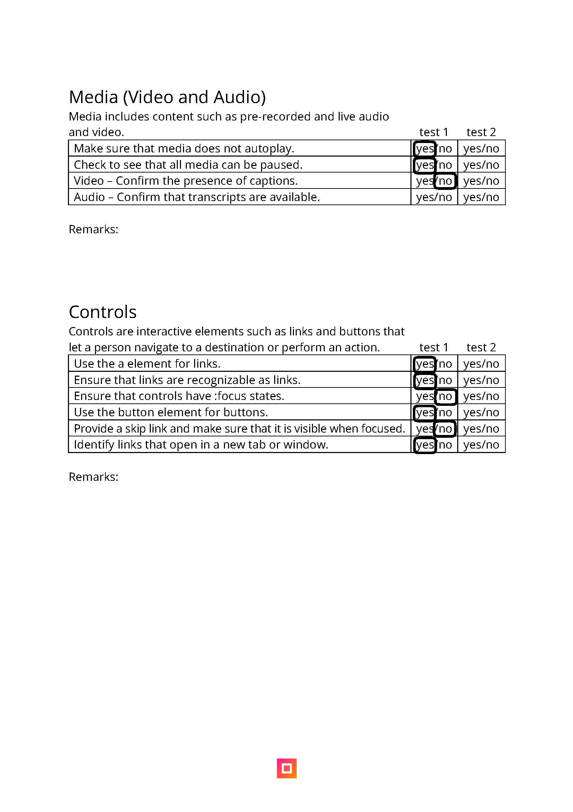
  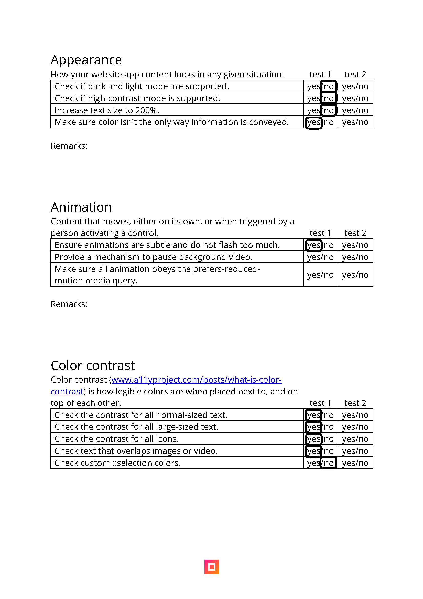

## Breakdownschets (week 1)

  
uitwerken na afloop 3e werkgroep

  ### de hele pagina: 
  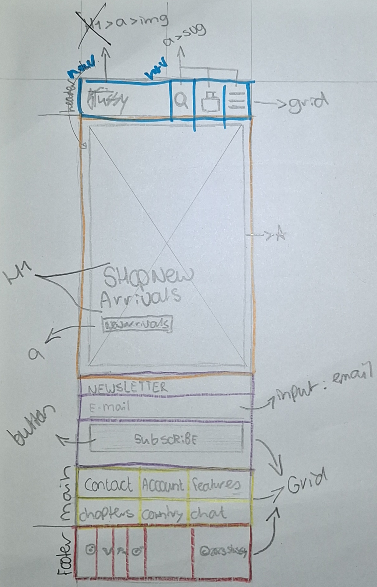

  ### dynamisch deel (bijv menu): 
  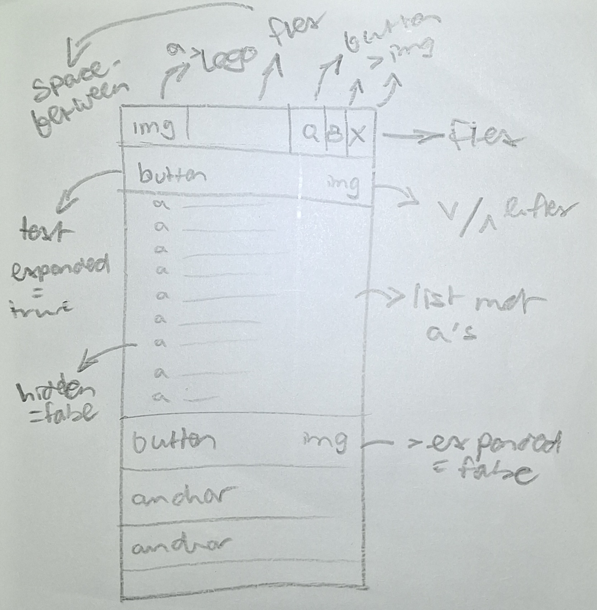

## Voortgang 1 (week 2)

  
uitwerken voor 1e voortgang

  ### Stand van zaken
  Deze week heb ik een paar momentjes gehad waar ik helemaal kriegel werd van de code. Eigenlijk ben ik de hele week bezig geweest met het maken van de navigatie en footer. Tussendoor heb ik ook aan de main van index.html gewerkt als afleiding van de header en footer.

  Ik ben blij dat ik met behulp van de docent tot de responsive afbeelding ben gekomen. Deze schaalt nu automatisch mee met de viewport van de browser.

  De custom properties laat ik voor nu nog even achterwegen en zal ik later toevoegen. Eerst vind ik het belangrijk om de basis van de HTML goed te krijgen. Samen met losse CSS werkt het uiteindelijk al een aardig stuk, maar ik heb wel een aantal keren de structuur van mijn HTML moeten aanpassen.

  ### Meeting met studentassistent
  Positieve feedback:

  De HTML van de website zag er goed en netjes uit, daar was ze tevreden over.
  - Toch moet ik wel focussen op de structuur...
    - Dit is belangrijk voor de screenreader en tab volgorde.
    - Daarnaast ook voor het begrijpen en aanpassen en stijlen van de elementen.

---
  Verbeter feedback:

  In de code was er nog ruimte voor verbetering.
  - De volgende verbeterpunten heeft ze toen benoemd...
    - Vergeet niet om gebruik te maken van de custom properties in CSS. Ik heb er toen bewust voor gekozen om deze later in te voegen omdat mij dit handiger en overzichtelijk leek.
    - Daarnaast kreeg ik ook te horen dat er nog verbetering mogelijk was bij de alt teksten van img's bijvoorbeeld. Ik ben het eens dat deze in het eindproduct moeten komen. Dit heb ik alleen in week 1 nog niet geregeld. Eerst lag mijn focus bij het werkend maken van de website.

---
  Vragen:

  Ik heb tijdens het gesprek met de studentassistent ook verschillende vragen kunnen stellen.
  - Deze vragen gingen over...
    - Het correct indelen van de HTML en de daarbij horende nav, header en main elementen. Ik heb gevraagd waar het het beste is om deze te plaatsen. Samen zijn wij tot de conclusie gekomen dat sommige elementen niet in de nav hoeven omdat deze in dezelfde pagina openen. Hier heb ik het over de shopping cart, search icon en hamburger menu. Deze openen niet in een nieuw tabblad en daarom heb ik deze ook niet in de nav gestopt. De items in het hamburger menu heb ik daarintegen wel in de nav gezet.

## Voortgang 2 (week 3)

  
uitwerken voor 2e voortgang

  ### Stand van zaken
  In week 2 heb ik vooral verder gewerkt aan het navigatie gedeelte van de website. Het koste veel tijd om met JavaScript de buttons open te laten "rollen". Ik heb hier met de docent ook nog over gedacht hoe de correcte manier was om dit te doen. Samen kwamen we tot de conclusie dat dit eigenlijk alleen kan met vaste variabelen. Ik heb hier uiteindelijk een andere keuze in gemaakt. De open animatie duurt nu korter dan het sluiten van verschillende tabjes in het hamburger menu. De afweging staat hierin tegenover toekomstige plannen. Er is nu een veel makkelijkere manier om het menu uit te bereiden. Mochten ze besluiten om een extra categorie met bierviltjes of iets dergelijks te maken, is hier nu direct de mogelijkheid toe. Dit had niet gekunt als dit met vaste getallen was geregeld. Dit is dus waarom ik heb gekozen voor deze kant van het verhaal.

  Ik merkte tijdens het programmeren en vooral testen dat het het beste was om als er een tweede menu wordt geopend, de vorige dicht te doen. In het kader van user experience is dit vaak een geprefereerde optie. Het enige was dat, omdat ik toggle states gebruikte voor de classList in JavaScript, dat de peiltjes van de buttons verkeerd konden staan ten opzichte van hun daadwerkelijke status. Daarnaast hield ik nog geen rekening met de aria labels die hierbij komen kijken. 

  ### Meeting met studentassistent
  Positieve feedback:

  De HTML van de website zag er nog steeds goed en netjes uit, daar was ze nog steeds tevreden over.
  - Ondanks dit mooie compliment was ik alsnog vaak bezig met een goede indeling van HTML te vinden waarin alles semantisch correct en logisch was. Naarmate ik doorging met het programmeren kwam ik telkens weer tegen nieuwe problemen aan waardoor het beter was om een andere indeling van HTML te gebruiken. Hierdoor gebeurde het wel eens dat ik delen even helemaal opnieuw moest doen.

---
  Verbeter feedback:

  In de code was er nog ruimte voor verbetering.
  - De volgende verbeterpunten heeft ze toen benoemd...
    - Ik heb in week 2 nog steeds niet gewerkt aan het invullen van de alt teksten van de img's. Hier werd ik nogmaals op geattendeerd.
    - Daarnaast werd ik ik week 2 ook gewezen op het feit dat dit bestand, het README.md nog een beetje achterliep. Ik ben het er mee eens dat ik dat was beter moet bijhouden in de toekomst. Het later invullen van een document als dit kost namelijk veel tijd. Als je het op het moment invult is het makkelijker om het goed te verwerken.

---
  Vragen:

  Ik heb tijdens het gesprek met de studentassistent ook verschillende vragen kunnen stellen.
  - Deze vragen gingen over...
    - Het scrollen tijdens het typen en zoeken van een zoek opdracht bij het zoek venster van de website. Ik kreeg feedback van de studentassistent dat het niet erg was als je kon scrollen. Dit heb ik daarom dus ook niet uitgewerkt. Later sprak ik de docent hierover en die vertelde mij dat het zeker wel beter is om dit scrollen uit te zetten. Ik heb daarom gewerkt aan een passende oplossing die scrollen in de body onmogelijk maakt als het search deel van de header open is.

## Toegankelijkheidstest 2/2 (week 4)

  
uitwerken na test in 9e werkgroep

  ### Bevindingen
  
  
  
  
  

Zoals te zien is op de lijst zijn er enkele zaken verbeterd en verslechterd. De zaken die slechter zijn geworden zijn dingen waar ik in deze week nog niet aan toe ben gekomen. Ze staan daarintegen wel op de lijst van dingen die snel moeten worden gemaakt.

Daarnaast heb ik ook een aantal dingen dus verbeterd en daar ben ik erg tevreden en blij mee.

## Voortgang 3 (week 4)

  
uitwerken voor 3e voortgang

  ### Stand van zaken
  In week 3 heb ik vooral grote stappen geboekt. Ik heb in deze week eigenlijk de gehele tees.html pagina afgemaakt. In de vorige week heb ik hier al een begin aan gemaakt maar deze was nog niet helemaal af. Het gebruiken van de buttons en list daaronder werkte wel, maar wederom met toggle classes. Ook de product pagina heb ik op deze manier laten werken. Ik ben kort bezig geweest om deze responsive te maken en de grid heb ik ook hier toegepast.
  
  Vervolgens ben ik ook een zeer grote tijd bezig geweest met het hertypen van mijn JavaScript. De volgende bugs/fouten zaten in mijn code:
  - Toggle classLists
  - Totale choas
  - Onnodige classes gebruiken voor styling
  - Niet mogelijk om aria labels te gebruiken met bestaande functies
  - Geen mogelijkheid voor hoog contrast
  - Geen mogelijkheid voor mindere animaties

  Het koste me wel wat tijd maar ik heb de nodige functies hergeschreven met if/else statements zodat er gebruik kan worden gemaakt van de aria labels voor de screenreaders. Het is natuurlijk erg belangrijk om de screenreader te ondersteunen met aria labels.

  De Javascript heb ik ook meer opgeruimd door met comments meer steun te bieden aan de persoon die de code bekijkt. Door het herschrijven van de functie's werd het vanzelf eigenlijk al beter, maar ook voor mezelf werkte het prettig om tijdens het programmeren extra hints te krijgen wat welke functie deed. Tijdens het doen van kleine ingrepen is het een stuk makkelijker om problemen te vinden.

  Ik heb in de CSS veel meer styling gedaan op basis van aria labels zoals aria hidden en aria expanded. Hierdoor wordt de code ook minder vol met onnodige classLists. De docent had al eerder benoemd dat dit voor bonus punten zou zorgen. Eerlijk gezegd had ik er weinig vertrouwen in dat ik hier gebruik van zou maken, maar ik heb er toch gebruik van gemaakt. Niet alles heb ik helaas kunnen doen door tijdsgebrek, maar ik heb toch een groot deel kunnen doen.
  
  Door het herschrijven werd het ook mogelijk om de aria labels te coderen met JavaScript. Dit geeft de screenreader meer informatie over bijvoorbeeld de status van het hamburger menu. Ik ben samen met de docent toch tegen een heel bijzonder probleem aangelopen waarbij de HTML niet werd geupdate in de browers inspector. Toen ik later lang en goed heb gekeken kwam ik erachter waar het aan lag en heb ik het gelijk opgelost.

  Op het laatste moment ben ik ook aan de slag gegaan om media querys te maken om zo mensen die graag minder motion of meer contrast willen te voorzien in hun behoeftes. Het was een stuk makkelijker dan ik dacht en ik ben erg blij dat dit in de opdracht zit verwerkt.

  ### Meeting met studentassistent
  Positieve feedback:

De volgende punten van positieve feedback werden gedeeld met mij...
  - De HTML van de website zag er nog steeds goed en netjes uit, daar was ze nog steeds tevreden over.
  - Er werd mij toch nog verteld dat ik toch echt gebruik van custom properties moest proberen. Op het laatste moment heb ik dit gedaan en ik heb spijt dat ik deze niet eerder heb gebruikt. Dit zijn echt top dingen van CSS die ik in de toekomst gegarandeerd zal gebruiken. Ook eerder in het proces.

---
  Verbeter feedback:

  In de code was er nog ruimte voor verbetering.
  - Pas de CSS styling aan op de aria labels van een HTML element. Dit is iets waar ik dus zeker nog mee aan de slag ben gegaan. Ik ben echt heel content met het feit dat dit werkt. Hierdoor is de code in het Javascript bestand een stuk rustiger en overzichtelijker.

---
  Vragen:

  Ik heb tijdens het gesprek met de studentassistent ook verschillende vragen kunnen stellen.
  - Deze vragen gingen over...
    - Het gebruiken van custom properties in CSS. Dit was eigenlijk een gesprek en hulpvraag aan de docent. Het nesten van de properties is dus een mogelijkheid. Dit heb ik ook toegepast voor de prefers reduced motion bezoekers waarbij de duration van de animatie op 0s wordt gezet. De gehele shorthand van de animatie staat in een custom property, maar de animation duration van deze animatie staat ook in een custom property. Deze property wordt dus aangepast aan de hand van een media query.

## Eindgesprek (week 5)

  
uitwerken voor eindgesprek

  ### Je uitkomst - karakteristiek screenshots:
  
  Een van de pagina's waar ik heel tevreden over ben. De pagina miste in het origineel een h1. Deze heb ik onzichtbaar toegevoegd, een daarnaast was er over de grote button met afbeelding totaal niets bekend voor de screenreader. Hier heb ik een figure van gemaakt met een duidelijkere bestemming van de link. Het is mij goed bevallen om een afbeelding mee te laten schalen met verschillende schermgroottes.
  ---

  
  De overzichtpagina met alle verschillende shirts viel mee om te maken. Het sorteer systeem (prototype) was het moeilijkste deel. Net gebruiken van grid is in dit geval het aller makkelijkste. Ik ben daarom ook erg blij dat we dat hebben geleerd met dit vak. Deze techniek wil ik ook graag vaker gebruiken in de toekomst.
  
  Op de originele pagina is het verschil van sold out items alleen getoond door een halve oppacity waarde en geen verschil in de letters. Doordat er vaak spullen zijn uitverkocht heb ik in het verleden vaak door het kleine contrast op uitverkochte spullen geklikt. Dit is in mijn ontwerp duidelijker doordat de prijs duidelijk is aangegeven met een zwarte background color en witte kleur en tekst die duidelijk maakt dat iets sold out is.
  ---

  
  Scherm 3 gaat over het hamburger menu. Deze komt vanaf boven naar beneden rollen. Daarin zitten nog meer uitklappende menus die dezelfde motion hebben. Ik ben erg blij dat het werkt, maar toch voelt het niet perfect doordat de transition niet even lang is als hij opent en dicht gaat. Het kan alleen niet anders zonder vaste eenheden te gebruiken. Ik heb gekozen om daarom relatieve units te gebruiken zodat het uitbereiden van deze menu's makkelijk mogelijk is. Er waren veel problemen tijdens het maken van dit menu, waarbij de peiltjes verkeerd om eindigden als je een ander menu opende, doordat ze elkaar sloten maar de classes met toggle werkten. Dit heb ik gelijk kunnen oplossen toen ik deze code verbeterde zodat ik aria attributen kon toevoegen.
  ---

  
  Ik ben tevreden over hoe het filter systeem er uit ziet. Toch lijkt het mij leuk om in de toekomst een systeem te maken dat daadwerlijk functioneel is. Dit is nu helaas niet het geval, omdat ik geen research heb gedaan naar de benodigde technieken. De uitklap menu's werken voor nu prima, zonder een transition op de input velden. De img's hebben wel een transition. Als ik meer tijd had had ik wel graag ook een vloeiende transition willen zetten zodat het hetzelfde gevoel geeft als het hoofd hamburger menu en de daarin zittende sub menu's. Voor nu voldoet dit gelukkig, wat mij betreft. 
  ---

  
Deze pagina heeft een grote verandering door gemaakt waardoor hij op gebied van gebruiksvriendelijkheid en accessibility een stuk verbeterd is. Op de originele website moet er namelijk worden gescrollt om de achterkant van een shirt te bekijken als een soort carrousel. Dit is iets wat niet accessible genoeg is wat mij betreft zonder het toevoegen van extra knoppen voor de besturing. Ik heb dit hele systeem aangepast waarbij er een duidelijke tekstuele weergave is van voor- of achterkant. Hierdoor is er ook geen verwarring mogelijk voor mensen zonder beperkingen. Soms lijken de voor en achter designs op elkaar waardoor het voor iedereen lastig is.
---

  ### Dit ging goed/Heb ik geleerd: 
  Korte omschrijving met plaatjes

  - Korte samenvatting van samengaande punten van het lijstje plus afbeeldingen van de vorige kop:
    - Semantisch correcter maken van de pagina's aan de hand van h1 toevoegen, aria labels en duidelijkere a's en img's met alt teksten.
    - Het gebruiken van het grid, wat verbazingwekkend makkelijk werkte.
    - Het maken van een uitrollend hamburger menu.
    - Het laten werken van alle bijpassende aria labels.
    - Het accessible maken voor mensen met hoog contrast of verminderde animatie instellingen.
    - Styling op basis van attributen; minder classes.
    - Het leren over custom properties.
  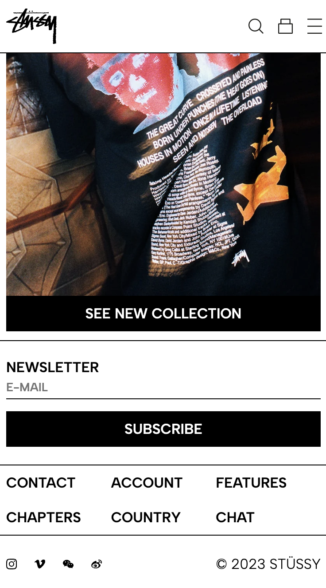
  *zie afbeelding voor verhoogd contrast*

  ### Dit was lastig/Is niet gelukt:
  Korte omschrijving met plaatjes

  - Het is mij niet gelukt om een werkend filter systeem te maken. Ik heb niet geleerd hoe dit moet.
  - Het is mij niet gelukt om enkele kleine niet werkende functionaliteiten werkend te krijgen.
  - Het was lastig om sommige bugs te vinden...
  - Tot mijn grote verdriet heb ik geen tijd gehad om een dark mode te maken :-(
  - Eigenlijk zou ik graag wat onderdelen die nu niet op de gewenste plek in de HTML staan willen veranderen. Helaas heb ik door te weinig tijd geen tijd om dit meer te doen.
  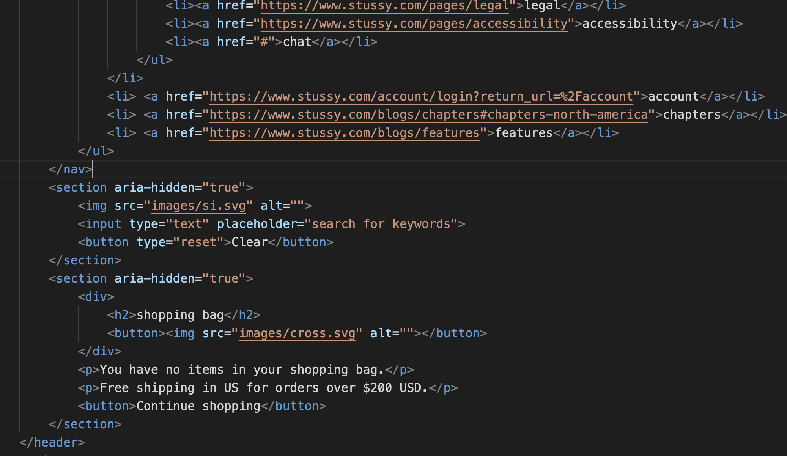

## Bronnenlijst

  
continu bijhouden terwijl je werkt

  Nb. Wees specifiek ('css-tricks' als bron is bijv. niet specifiek genoeg). 
  Nb. ChatGpT en andere AI horen er ook bij.
  Nb. Vermeld de bronnen ook in je code.

  1. bron 1
  2. bron 2
  3. ...

